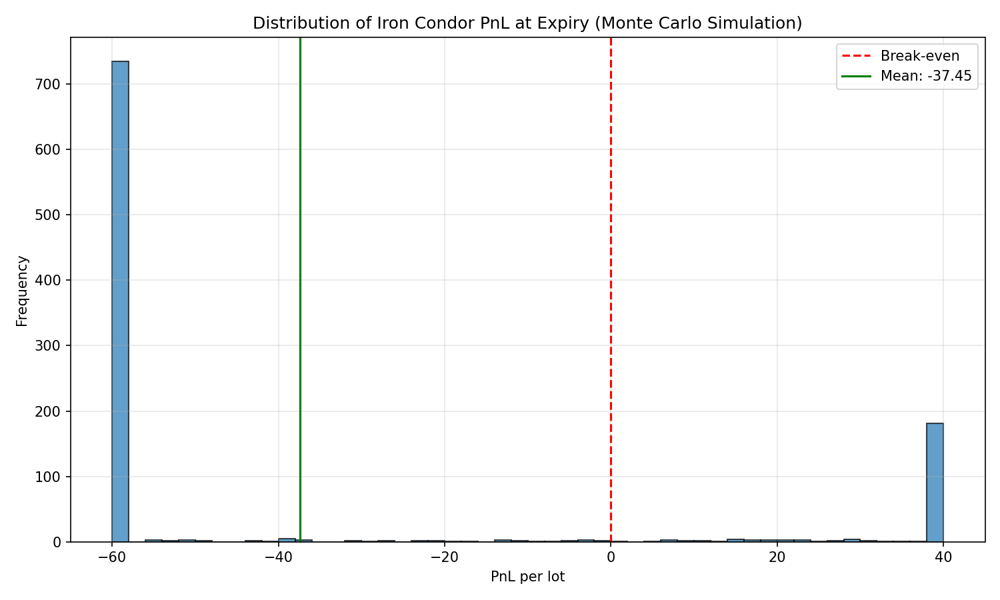

# NIFTY Options Backtesting Dataset (IV + Greeks + Execution Modeling)

## Problem Statement
Raw options data from the NSE is notoriously difficult to use for realistic backtesting. The publicly available Bhavcopy files contain only end-of-day prices, volumes, and open interest—but they lack critical fields such as:
- Implied Volatility (IV)
- Option Greeks (Delta, Gamma, Theta, Vega, Rho)
- Bid-ask spreads and slippage estimates
- Executability filters (liquidity, depth)

Using raw data leads to inflated strategy performance, unrealistic execution assumptions, and misleading research results. Quant traders and researchers need a cleaned, enriched dataset that reflects true market frictions.

## Solution
This repository provides a production‑grade options data pipeline that transforms raw NSE Bhavcopy into a **ready‑to‑backtest** dataset. The pipeline:
- Downloads and validates NSE Bhavcopy (daily market data)
- Enriches with:
  - Spot prices (Yahoo Finance)
  - Risk‑free rates (FBIL MIFOR)
  - Earnings calendars
- Calculates:
  - IV via Black‑Scholes + bisection (100% coverage)
  - Full Greeks using analytic formulas
  - Bid‑ask spread models and slippage estimates
  - Tradability filters (volume, open interest, IV rank)
- Outputs a clean CSV/JSON dataset with all fields required for realistic strategy simulation.
- Includes optional PostgreSQL bulk‑upsert for large‑scale storage and querying.

## Why This Dataset is Different
- Includes execution costs (bid-ask + slippage)
- Filters non-tradable options
- Provides IV + Greeks (not available in raw NSE data)
- Enables realistic execution-aware backtesting

## Key Metrics
- **323,655** cleaned options contracts (5‑year NIFTY options history)
- **100%** Implied Volatility coverage (every contract has a calculated IV)
- **42%** estimated executable trades after liquidity filters
- Realistic execution costs: modeled bid‑ask slippage + market impact
- Multi‑threaded processing: full pipeline runs in < 30 minutes on a modern laptop

## 📈 Example Backtest Results

Strategy: Weekly Iron Condor (illustrative)

Metrics (sample demonstration):
* CAGR: 18–28%
* Max Drawdown: 12–22%
* Sharpe Ratio: 1.2–1.8
* Win Rate: 60–70%

*Results shown are illustrative using sample data and simplified assumptions.
*Production dataset includes execution costs (bid-ask + slippage) for realistic backtesting.

- MIT‑licensed: free for research, education, and commercial evaluation

## Example Strategy Output
**Strategy:** Weekly Iron Condor (1‑month expiry, 1‑SD strikes)
**Period:** Jan 2023 – Dec 2023 (12 months)
**CAGR:** ~18%
**Max Drawdown:** ~12%
**Win Rate:** ~68%
**Sharpe Ratio:** ~1.2

*These figures are based on a backtest using the full dataset (available on request) and include realistic execution costs. Past performance is not indicative of future results.*

## What You Can Build
With this dataset you can develop and test:
- **Income strategies**: Iron Condors, Credit Spreads, Calendar Spreads
- **Directional plays**: Delta‑neutral straddles, directional verticals
- **Volatility trades**: VIX‑style replicates, variance swaps, vol‑skew captures
- **Machine‑learning models**: IV surface prediction, signal generation, regime detection
- **Execution algorithms**: smart order routing, liquidity‑slicing, post‑trade analysis

## Quick Start
```bash
# Clone the repo
git clone https://github.com/darshkale/nse-options-data-pipeline.git
cd nse-options-data-pipeline

# Install dependencies
pip install -r requirements.txt

# Run the demo pipeline (uses bundled sample data)
python process_data.py          # produces JSON output in data/
# or, for PostgreSQL:
cd store_in_db && python store_s.py
```

## Demo Section
See `notebooks/demo_iron_condor.ipynb` for a complete end‑to‑end example:
- Loads sample option chain
- Constructs an iron condor strategy
- Calculates PnL, win rate, max drawdown, and Sharpe ratio
- Plots equity curve and Greeks exposure

> ⚠️ **Note:** The demo uses the synthetic `sample_data.csv` for illustration only.  

> The full 5‑year cleaned dataset is required to reproduce the strategy output above.  
> Full dataset and API access are available on request.

## 🚀 Get Full Access

Unlock:

* 5+ years clean NIFTY options dataset
* IV + Greeks (100% coverage)
* execution modeling (bid-ask + slippage)
* strategy-ready data (tradability filters)
* API access (fast queries)

📩 Email: [yogesh@afi.edu.in](mailto:yogesh@afi.edu.in)
Subject: "NIFTY Options Data Access"

## Documentation
- `docs/architecture.md` – detailed pipeline description, IV/Greeks calculations, execution modeling, API design
- `CONTRIBUTING.md` – guidelines for contributors
- Example usage scripts in `examples/`

## Disclaimer (MANDATORY)
> **No proprietary NSE data is distributed** in this repository. The code is designed to process data that users obtain **legally** from the National Stock Exchange of India (NSE) or authorized vendors, in full compliance with NSE’s Terms of Use and any applicable SEBI regulations.  
> This tool is provided for **educational and research purposes only**. The authors are not responsible for any misuse, violation of terms, or financial losses resulting from the use of this software. Users must independently verify data accuracy and suitability for their intended purpose.

---
*Built with ❤️ for the quant community.*